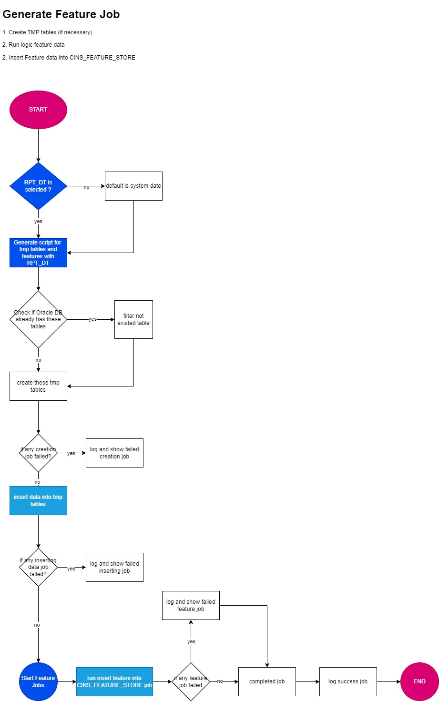
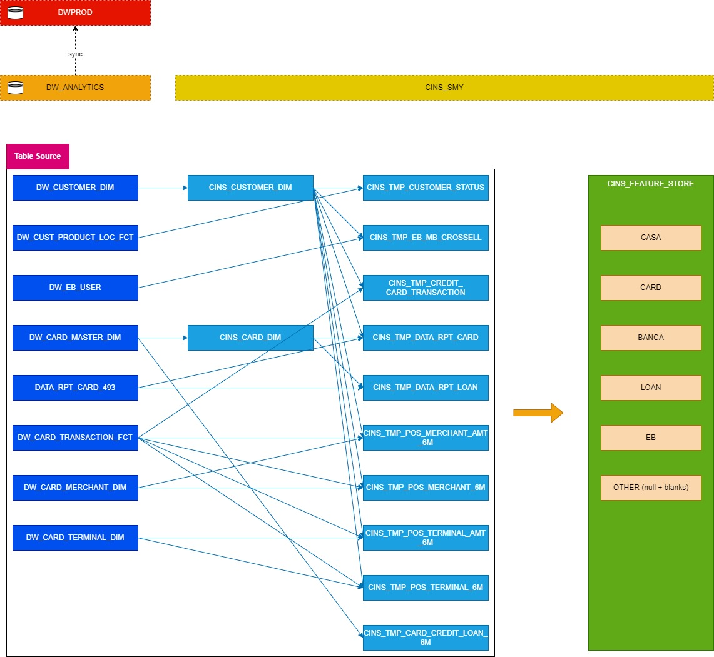

# Feature Store

## Folder Structure

```lua
feature_store
|-- config
|-- sql
|   |-- config
|   |-- template
|   |   |-- ddl
|   |   |-- dml
|   |   |-- feature
|-- store_procedure
|   |-- config
|   |-- template
|   |-- script
|-- check_DB.py
|-- gen_feature.py
|-- gen_script.py
|-- gen_table.py
|-- main.py
|-- oraDB.py
|-- ft_dependency.py
```

Tất cả code SQL feature được chứa tại sql/template/feature. Lưu ý đây là template cần truyền RPT_DT vào

## Abstract Concept

Dưới đây là Concept Flow để sinh ra Feature Store




## Data Lineage


