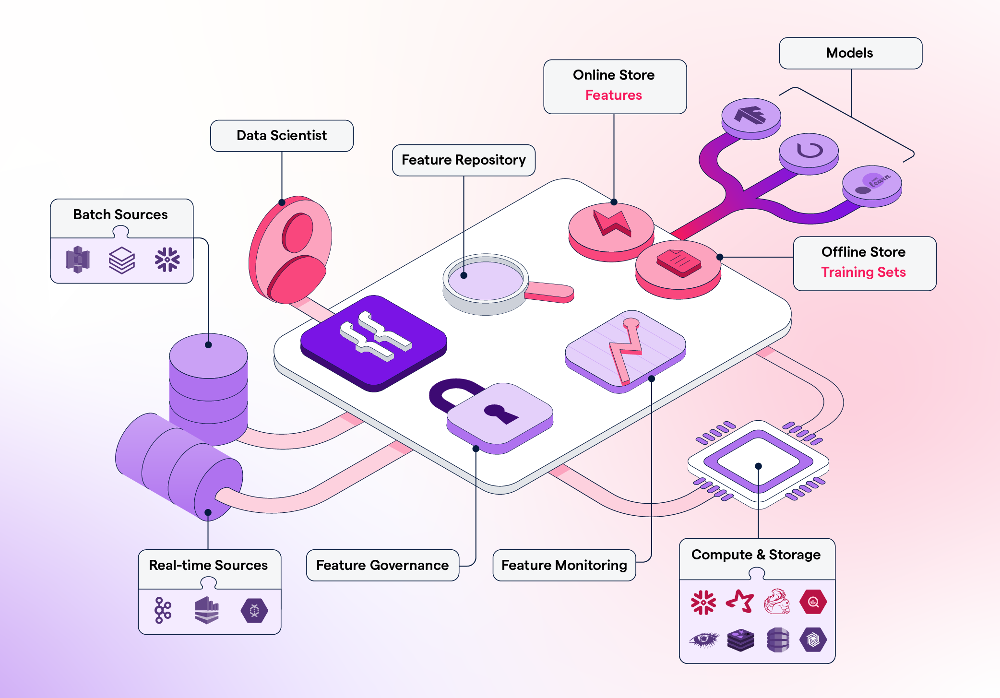
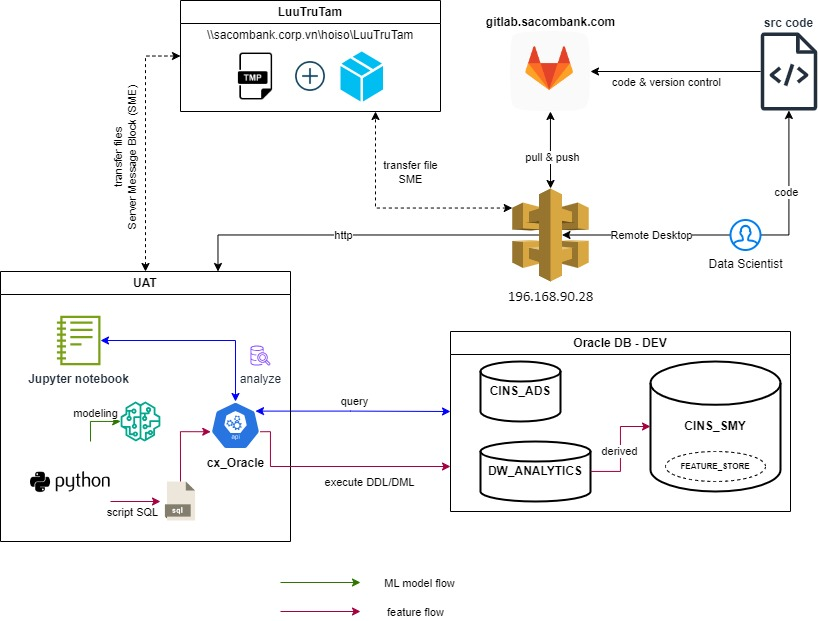

# Feature Store



## Architecture

### Connection

Description:

- Kết nối với Jupyter Notebook qua Gateway

- Không thể pull/push trực tiếp code từ GitLab sang UAT-Jupyter Notebook

- Bắt buộc File-Sharing (SME) qua vùng LuuTruTam (ko thể git pull/push)

- Kết nối đến Oracle DB thông qua cv_Oracle API



## Environments

### Datawarehouse

|Schema|DW_ANALYTICS|
|-----|-------|
|Hostname|192.168.124.100|
|Port|1521|
|Password| (request permission)|
|Service name| DWDEV|

|Schema|CINS_ADS|
|-----|-------|
|Hostname|192.168.124.100|
|Port|1521|
|Password| (request permission)|
|Service name| DWDEV|

| Schema | CINS_SMY |
|-----|-------|
|Hostname|192.168.124.100|
|Port|1521|
|Password| (request permission)|
|Service name| DWDEV|

### Jupyter Notebook

| Key | Value |
|-----|-------|
|Env|UAT|
|Protocol| https |
|URL| cins01.apps.uat-cloud.sacombank.local|
|Location|/opt/bitnami/jupyterhub-singleuser/hcl-quanht/feature_store|
|Username|user2|
|Password| (request permission)|

## Folder Structure

```lua
feature_store
|-- config
|-- sql
|   |-- config
|   |-- template
|   |   |-- ddl
|   |   |-- dml
|   |   |-- feature
|-- store_procedure
|   |-- config
|   |-- template
|   |-- script
|-- check_DB.py
|-- gen_feature.py
|-- gen_script.py
|-- gen_table.py
|-- main.py
|-- oraDB.py
|-- ft_dependency.py
```

Tất cả code SQL feature được chứa tại sql/template/feature. Lưu ý đây là template cần truyền RPT_DT vào

## Abstract Concept

Dưới đây là Concept Flow để sinh ra Feature Store


## Data Lineage


